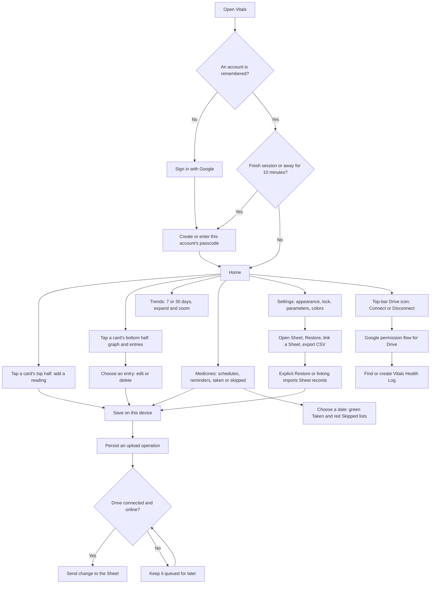

# RenVitals: website workflow and code guide

This guide describes the current local version, including the top-bar Drive button and approved medicine history. See FIXES.md for the approved fixes and remaining limitations.

## How a person uses the app

Google account sign-in and Google Drive connection are separate steps. Signing into the app identifies whose local records to load. Connecting Drive grants access to the app's Sheet.

## Screens and actions

| Area | What it does | Where the result goes |
|---|---|---|
| Home | Shows today's volume totals and latest other readings; supports tile order and size editing | Readings are local and queued for Drive; tile layout is local only |
| Entry form | Adds or edits fluid, urine, blood pressure, sugar, or custom values, with date, time, and notes | Account's local entries, then upload queue |
| Day detail | Shows one metric on a chosen date; allows editing and deleting entries | Same local entries and queue |
| Trends | Shows daily totals or averages over 7/30 days; BP and sugar have separate series; charts expand and zoom | Display only |
| Medicines | Adds schedules, imports schedules from text, tracks taken/skipped doses, and shows history | Medicines and DoseLog locally and on the Sheet |
| Settings | Appearance, 12/24-hour time, passcode/biometric preferences, custom metrics, colors, Restore, sheet linking, CSV export | Preferences local; metric definitions can be uploaded |
| Profile | Name/email/photo from Google, local age/gender, switch account, sign out and delete local account data | Local account registry and profile fields |
| Top-bar Drive | Red when disconnected, orange during authentication, green when a token is held; popup offers Connect/Disconnect | Account's stored Drive session |
| Dashboard | Separate read-only page: enter a Sheet link and authorize Google access to view Home, Trends, and Medicines | No writes to the Sheet; token in memory, no local health database |

Restore, sheet linking, Open Sheet, and CSV export stay in Settings. Automatic uploads use the connection established through the header popup.

## Startup and returning visits

1. Load HTML, shared styles, Drive module, and app module.
2. If no active account is remembered, show Google Sign-In. On first account sign-in, migrate legacy local records and Drive state.
3. Load that account's preferences, merge duplicate local custom metrics, attach controls, render screens, and start medicine checks.
4. Require passcode setup if none exists. Otherwise require unlock for a fresh session, an explicit account sign-in, or a return after the ten-minute grace period.
5. Initialize Drive from stored account-specific state. A still-valid token allows immediate backup without a fresh Google screen.
6. A successful PIN/biometric unlock can attempt a silent reconnect for an account that previously authorized Drive.
7. Register the service worker to cache the app shell and detect updated assets.

Offline use after prior setup is supported by cached files and local storage. First Google sign-in and Drive operations need online access.

## The actual backup workflow

The automatic path is **device to Sheet**. It reads remote rows to decide what to upload, but does not automatically merge those rows into the device.

- A save queues an upsert. A deletion queues a deletion marker rather than removing the remote row.
- Queue operations are separated by record type and stable ID.
- Pending operations persist across page reloads.
- Connecting, the roughly one-minute background timer, returning to the visible page, and network recovery trigger upload work.
- A successful full sync records the last-sync time. Nearby full-sync triggers are coalesced within twenty seconds.
- Restore explicitly imports missing or newer non-deleted remote records. It does not remove local records.
- Linking verifies a supplied Sheet link, changes the stored Sheet ID, performs a restore, and then uploads.
- Disconnect clears the access token and authorization flag; it keeps local data, the queue, and the remembered Sheet ID.

Uploads preserve newly queued edits and check remote timestamps before writing. Same-browser tabs share an upload lock where supported. This is not a transactional cross-device database: simultaneous writes from different devices remain a limitation. Explicit Restore is still required to bring remote changes into the device.

## Data and storage

| Data | Device storage | Sheet tab |
|---|---|---|
| Health readings | entries array under the current account | Sheet1 |
| Custom parameter definitions | customMetrics array | Metrics |
| Medicine schedules | medicines array | Medicines |
| Taken/skipped dose marks | doseLog object keyed by medicine/date/time | DoseLog |
| Theme, clock format, PIN hash/salt, biometric ID | settings | Not uploaded |
| Tile order/size and per-card color overrides | homeLayout and colorOverrides | Not uploaded |
| Profile age and gender | profileFields | Not uploaded |
| Reminder firing times | medFiredLog | Not uploaded |
| Drive token, expiry, Sheet ID, queue, authorization, last sync | Separate per-account Drive keys | Not themselves uploaded |

Local health records are plain browser storage, not encrypted by the PIN. Account prefixes separate normal app use but do not prevent someone with browser-storage access from reading the records.

## Medicines and notifications

Each medicine record has one scheduled time and either daily or selected weekdays. A twice-daily medicine uses two records.

The app checks schedules every twenty seconds while its JavaScript can run. A due, pending dose can remind again every five minutes until marked taken/skipped, or until the day ends. Custom tones play while the page is visible. The service worker displays notification taps; it does not independently schedule medicine reminders. A closed or suspended browser can delay or prevent reminders.

## Separate dashboard

dashboard.html loads dashboard.js and the shared stylesheet. A viewer supplies a Sheet link or ID and authorizes Google access. The page reads four tabs using the authenticated Sheets API, with a one-minute refresh interval. There is no app PIN or local health database on this page.

Google controls access to the selected Sheet; this is not a server-backed medical portal. No Sheet sharing setting was checked or changed.

## Code map

| File | Responsibility | Main places to start |
|---|---|---|
| index.html | Main screens, forms, dialogs, and navigation targets | Header, panel sections, entry sheet, Drive dialog |
| app.js | Accounts, local DB, entry editing, charts, medicine reminders, locks, UI controls | init, initForAccount, wireEvents, renderAll |
| drive.js | OAuth, Sheet schema, row conversion, upload queue, explicit restore/linking | VitalsDrive public API, syncNow, enqueueChange, flushQueue, restoreFromSheet |
| dashboard.html | Read-only viewer markup | Home/Trends/Medicines panels |
| dashboard.js | Authenticated Sheet reading and read-only rendering | connectDashboard, loadData, row parsers, renderAll |
| styles.css | Shared design, themes, responsive layout, charts, dialogs | Theme variables, panel and overlay rules |
| service-worker.js | Offline file cache and notification clicks | APP_SHELL and install/activate/fetch handlers |
| manifest.json | Installable-app metadata and icons | start_url, scope, icons |
| icons/ | Static app icons | Manifest and notification references |

app.js exposes VitalsAccount so drive.js can select account-specific storage. drive.js exposes VitalsDrive for UI actions and emits vitals-drive-status to update the status controls. drive.js accesses the DB defined in app.js after initialization.

## Maintenance rules

- Keep account namespacing and the stored Sheet columns compatible with existing users.
- Keep main-app and dashboard parsers aligned deliberately: they currently differ in some details.
- Update query versions and service-worker cache entries together when shipping changed runtime assets.
- Keep data changes separate from rendering changes.
- Compare old/new queue records and UI side effects when refactoring.
- Keep historical findings in AUDIT.md and current fix status/limits in FIXES.md.
